# **NoteSy** - All your notes. Oragnized. Effortless.

Inspiration strikes everywhere. **Notesy** lets you
capture your ideas across any device.

## About 🎯

NoteSy is a web app built using the MERN stack! User's can create an account and write down all their notes and access them in any device they want.

## Try it out

You can try NoteSy by visiting: https://mern-notes-q4qr.onrender.com
The first load can be very slow, might take some minutes, as NoteSy is hosted on Render's free plan, so server's shut down after 15 minutes 🥲


## NoteSy Features 🔥

- **Authentication** - Users can create account using Email based authentication
- **Create Note** - Users can create their notes and access them form all around the world.
- **Label Notes** - Users can label their notes for better organization.

## 📸 Screenshots 🖥️

|                                    |                                 |
|------------------------------------|---------------------------------|
| 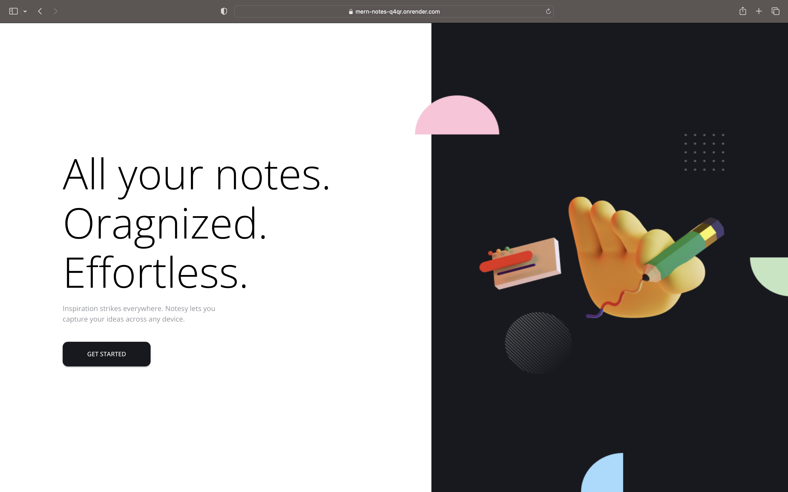     | 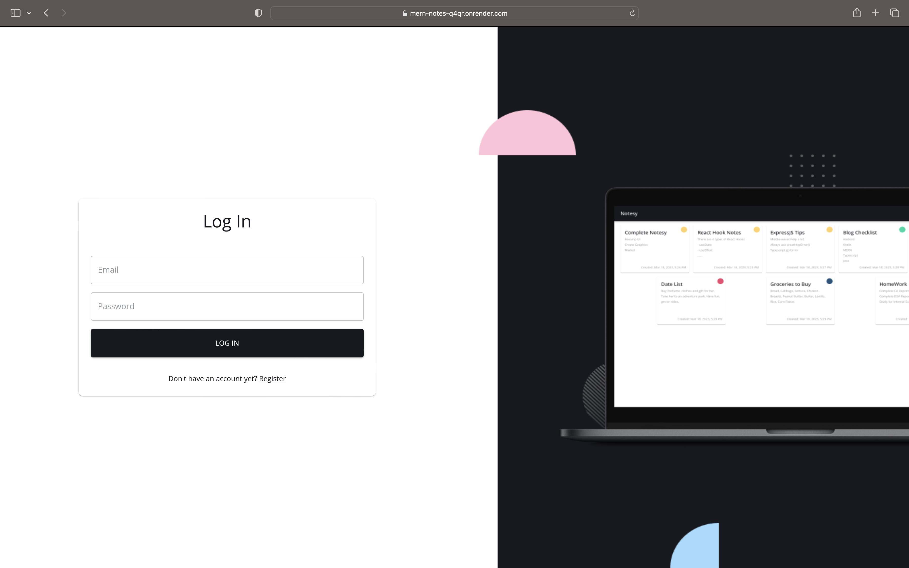 |
| 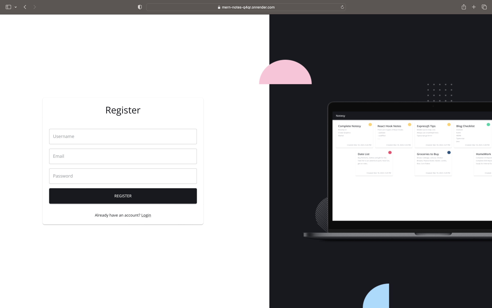 | 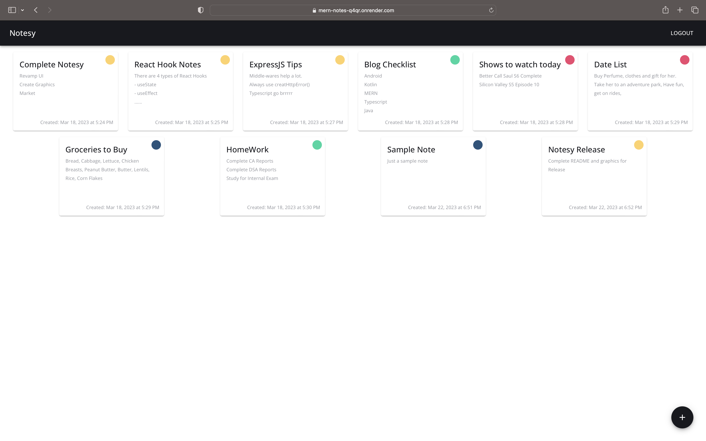 |
| 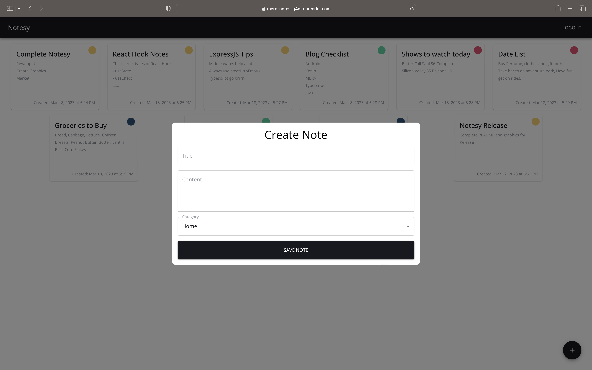   |   |

## 📸 Screenshots 📱

|                                |                                 |                                   |
|--------------------------------|---------------------------------|-----------------------------------|
| 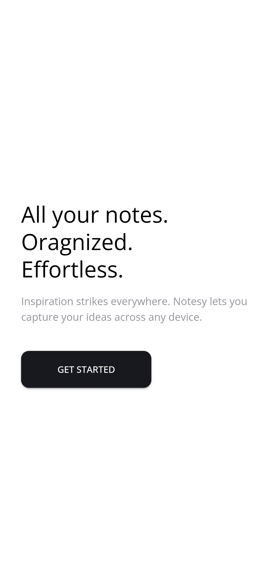  | 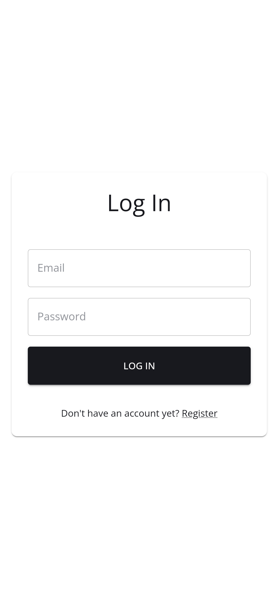  | 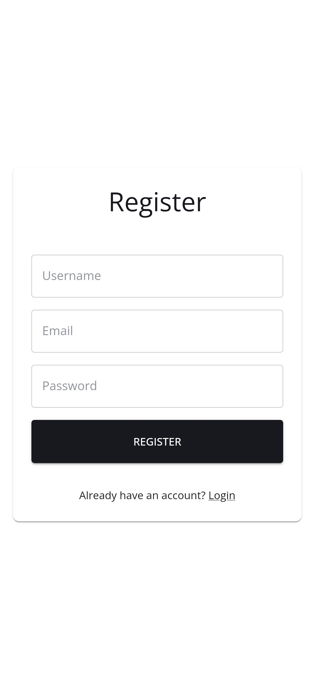 |
| 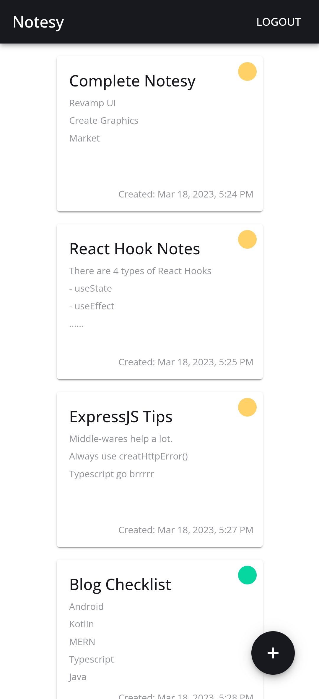 | 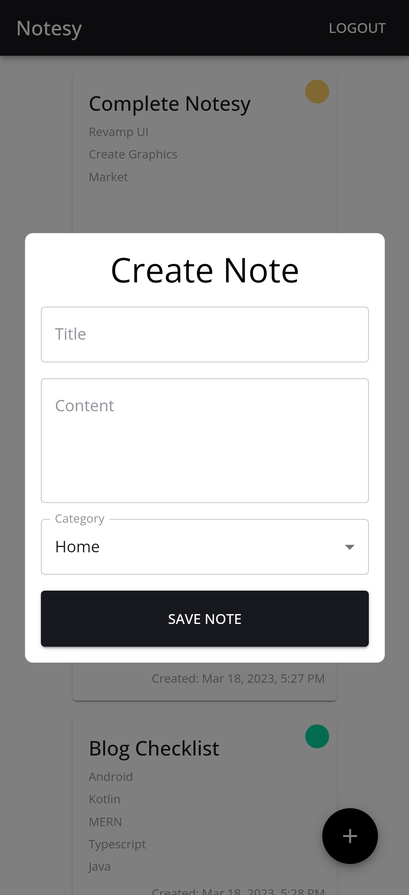 | 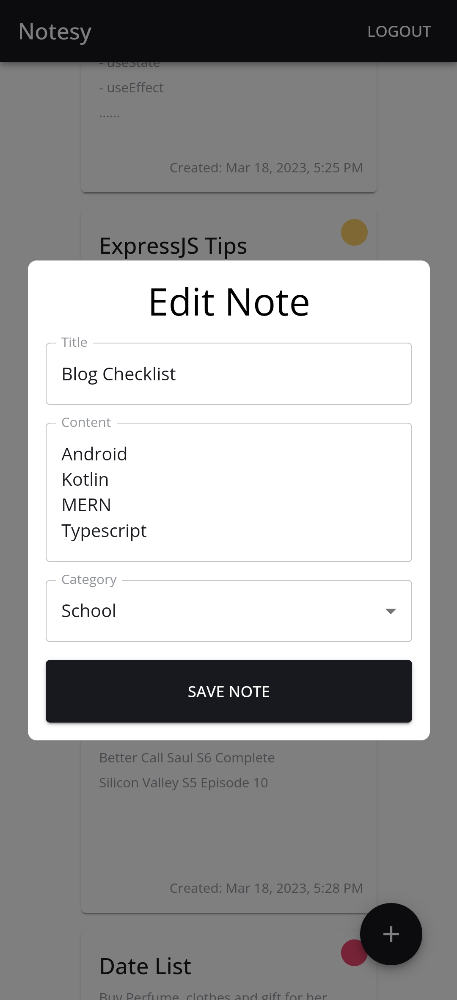     |

## Technical details 💡
- The frontend of NoteSy is created using ReactJS and MaterialUI. NoteSy is highly responsive. All the React components and package structure is properly organized.
- The backend of NoteSy is built using NodeJs, ExpressJs, MongoDB. For authentication, NoteSy makes use of session based authentication.

## Tech Stack

- [React](https://react.dev) - The library for web and native user interfaces.
- [MaterialUI](https://mui.com) - MUI offers a comprehensive suite of UI tools to help you ship new features faster.
- [NodeJs](https://nodejs.org/en) - Node.js® is an open-source, cross-platform JavaScript runtime environment.
- [ExpressJs](https://expressjs.com) - Fast, un-opinionated, minimalist web framework for Node.js
- [MongoDB](https://www.mongodb.com) - MongoDb is a NoSQL database.
- [Typescript](https://www.typescriptlang.org) - TypeScript is a strongly typed programming language that builds on JavaScript, giving you better tooling at any scale.

## Project Setup ✏️
To clone this project and customize it further, you need to do a couple of tasks first:
1) Create an account on [MongoDB Cloud](https://cloud.mongodb.com/), setup a cluster and get its [connection string](https://www.mongodb.com/docs/guides/atlas/connection-string/)
2) Clone this project. You can directly download the source code .zip file, or you can use the git clone command in terminal
3) Once successful, open your preferred IDE and run some tasks and write some setup code.
4) Run the following commands in your terminal

    ```
    npm install
    cd frontend
    npm install
    cd ..
    ```

5) After this, create a new file with the exact name of ".env"
6) In the .env file, write:<br><br>

    ```
    PORT = 5000
    MONGO_DB_CONNECTION_STRING = --paste your cloud mondodb cluster's connection string--
    SESSION_SECRET = --enter any random string--
    PWD_HASHING_ROUNDS = --Enter any number here, higher represents more rounds of hashing--
    ```
   
7) You are all set up now! To start the backend server, in terminal write:
    
   ```
    npm start
    ```
   
8) And to start the frontend, write:

    ```
    cd frontend
    npm start
    ```
   
9) Then write localhost:3000 in your browser to be able to use NoteSy!

---

## Contact
If you need any help, you can connect with me.

Visit:- [Vaibhav Jaiswal](https://vaibhavjaiswal.vercel.app/#/)
